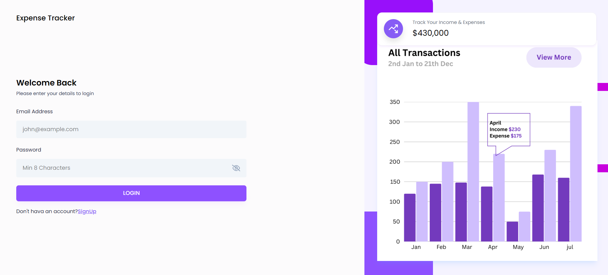
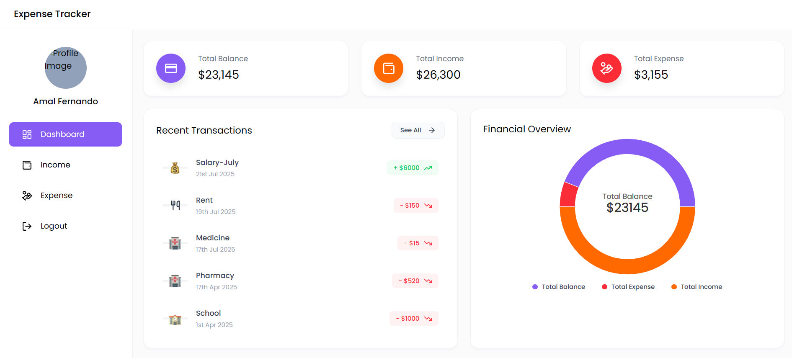
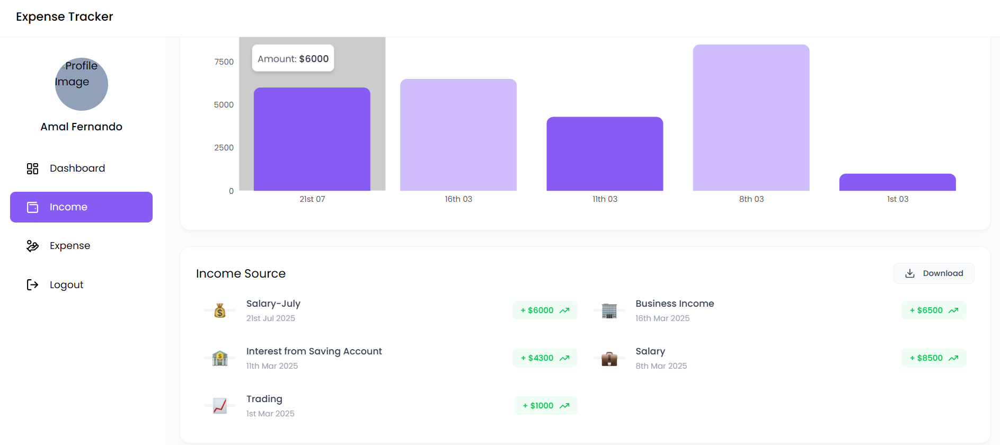
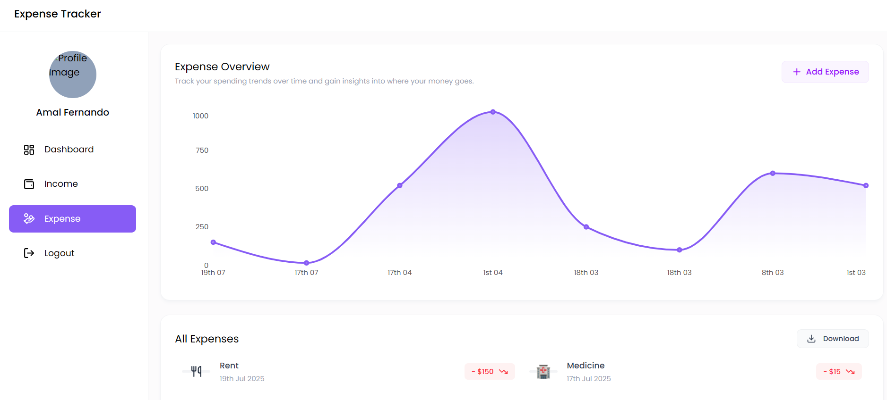

# 💸 MERN Expense Tracker App

A fully responsive, full-stack **Expense Tracker App** built with the **MERN (MongoDB, Express, React, Node.js)** stack. This app helps users track their income and expenses, visualize data through interactive charts, and export records in Excel format. It features JWT-based authentication and works seamlessly across desktop and mobile devices.

---

## 🚀 Features

✅ **User Authentication** – Secure login and signup using JWT  
✅ **Dashboard Overview** – Summary cards for Total Balance, Income, and Expenses  
✅ **Income Management** – Add, view, delete, and export income data  
✅ **Expense Management** – Add, view, delete, and export expenses with categories  
✅ **Interactive Charts** – Pie, Bar, and Line charts to visualize financial data  
✅ **Recent Transactions** – Quickly see the latest records  
✅ **Reports** – Download income and expense data as Excel files  
✅ **Responsive UI** – Mobile-first design using Tailwind CSS  
✅ **Intuitive Navigation** – Sidebar menu for easy access to key features  

---

## 🖼️ Screenshots

### 🔐 Login/Sign up page


### 📊 Dashboard Overview


### ➕ Add Income


### ➖ Add Expense


### 📈 Charts & Reports


---

## 📂 Project Structure

```bash
expense-tracker/
├── backend/
│   ├── controllers/
│   ├── models/
│   ├── routes/
│   ├── middleware/
│   
├── frontend/
│   ├── components/
│   ├── pages/
|   ├── hooks/
│   ├── context/
|   ├── utils/
│   ├── App.jsx
│   └── main.jsx
├── .env
└── README.md
```
---

## 🛠️ Tech Stack

### Frontend:
- React
- Tailwind CSS v4
- Axios
- Chart.js

### Backend:
- Node.js
- Express.js
- MongoDB with Mongoose
- JWT for authentication


---

## ⚙️ Getting Started

### 1. Clone the Repository

```bash
git clone https://github.com/SachiniPinnaduwa/Expense-Tracker.git
cd Expense-Tracker
```

### 2. Install Dependencies

```bash
# Backend
cd backend
npm install

# Frontend
cd ../frontend
npm install
```
### 3. Configure Environment Variables
Create a .env file inside the backend/ folder:
```bash
PORT=8000
MONGO_URI=your_mongodb_connection_string
JWT_SECRET=your_secret_key
```
### 4. Start the Application
```bash
# Start Backend
cd backend
npm run dev

# Start Frontend
cd ../frontend
npm run dev
```

